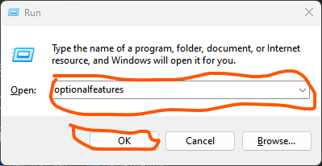

# Voodoo-Kali  
Voodoo magic to run Kali Linux desktop panels and gui apps on Windows 10  

### Installation: 
<ol>
   <li>
      Open run and type ```optionalfeatures``` and click on ok
      
   </li>
</ol>
1. Start kali in Windows 10 as normal, unprivileged user  
2. Run  
   ```
   wget https://github.com/rootleet/kali-wsl-gui/blob/master/install-WSL-Kali-X  
   bash ./install-WSL-Kali-X  
   ```