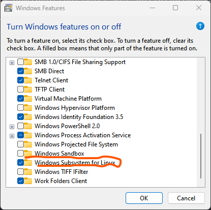

# WSL-KALI-GUI  
Voodoo magic to run Kali Linux desktop panels and gui apps on Windows 10  

### Installation: 
<ol>
   <li>
      Open run and type <code>optionalfeatures</code> and click on ok  
      
   </li>
    <li>
      Enable WSL 
      
   </li>
   <li>
    Goto Microsoft Store and install Kali Linux from using the link below  
    <a href="https://www.microsoft.com/store/productId/9PKR34TNCV07" target="_blank">https://www.microsoft.com/store/productId/9PKR34TNCV07</a>
   </li>
    <li>
        After installation, run kali WSL,  set user credential then download and execute the gui script with the command below  
        <code>wget https://github.com/rootleet/kali-wsl-gui/blob/master/install-WSL-Kali-X</code>    
        <code>bash ./install-WSL-Kali-X</code>  
        The commands above will download installation script and execute it.  
        After installation, you will be prompted to set separate passwords for full control and view mode.
          Then first instance will run automatically
    </li>
</ol>

### Running
Anytime you want to run the gui version again
<ol>
    <li>Open Kali from start or type in terminal</li>
    <li>Execute <code>kex --win -s</code></li>
</ol>
